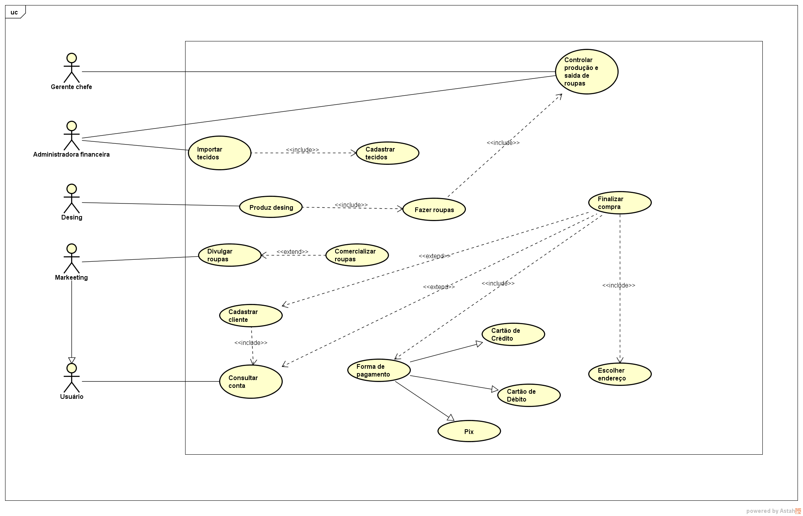
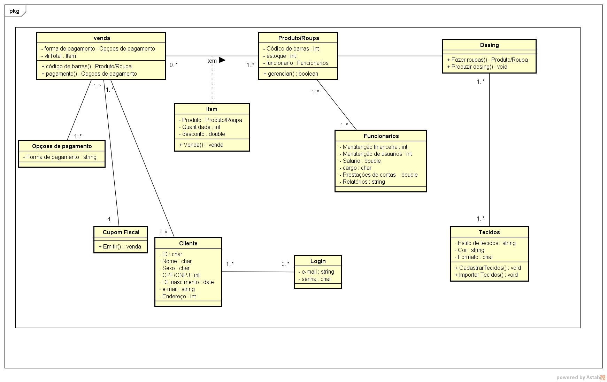
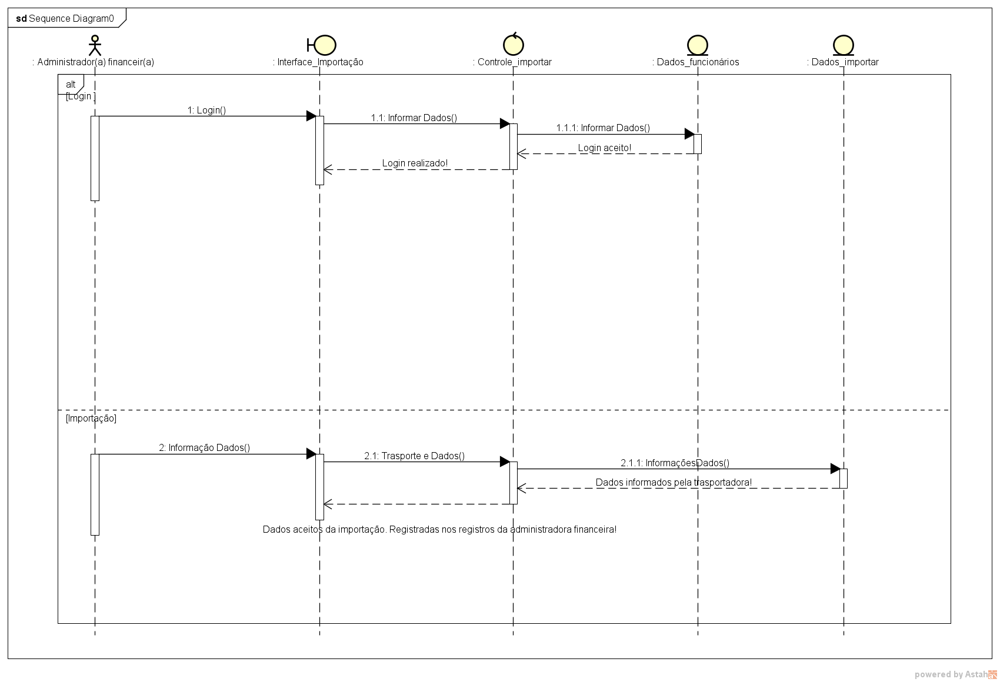
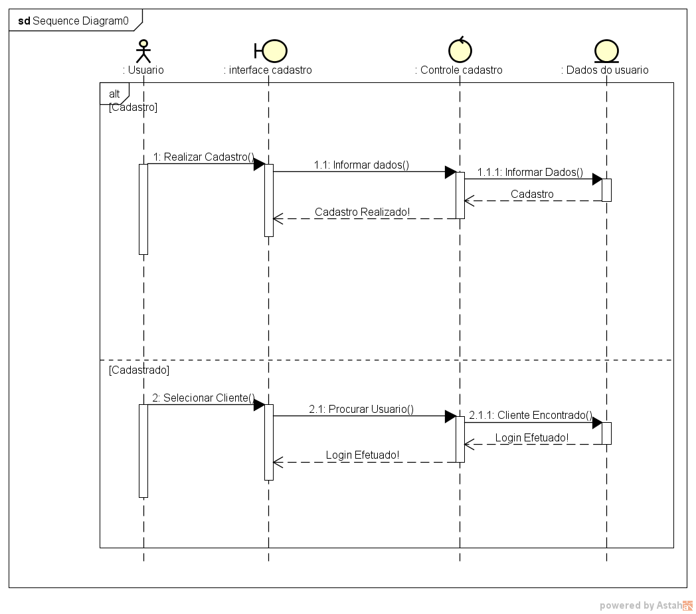
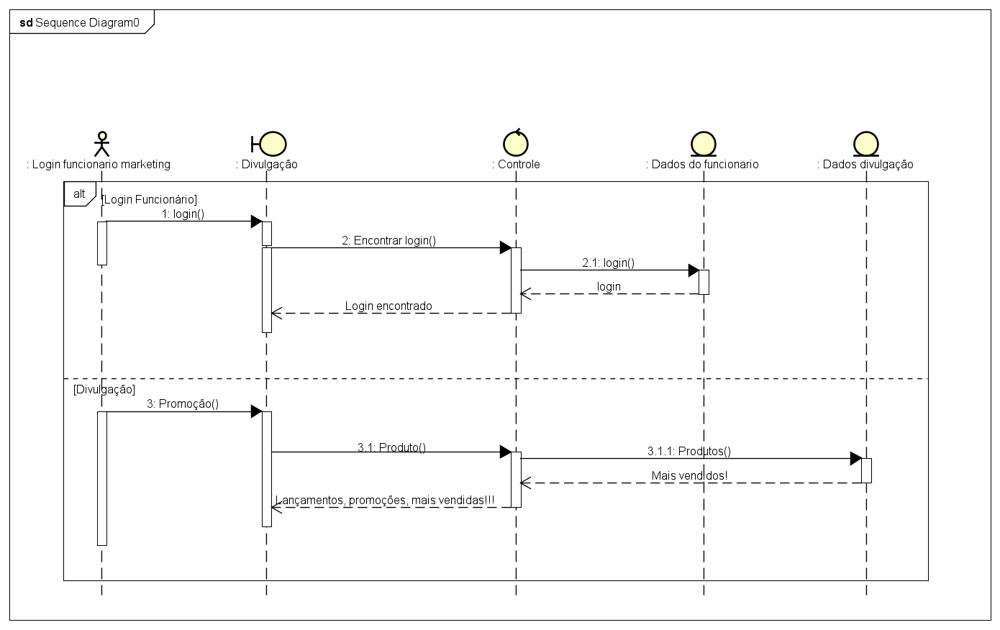
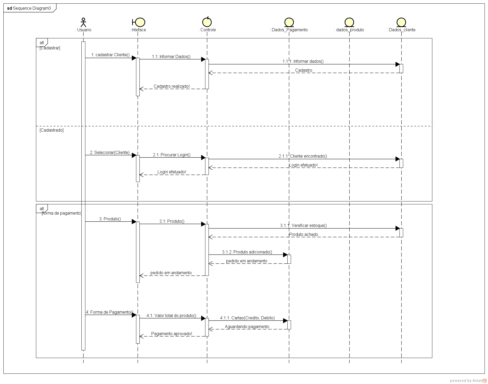

# *AmericanStark*

# PROJETO DE SOFTWARE

## *Stakeholders*
|NOME|CARGO|E-MAIL|
|:---|:---|:---|
|Beatriz Rocha Oliveira|Administradora Chefe|beatriz.braesp@gmail.com|
|Dáfelli Kauani Bonazzi Pinto|Administradora Financeira|dafellikauani@gmail.com|
|Tamires Steffany Cardoso dos Santos Schimites|Markeeting|tamyresschimite@gmail.com|
|Gabrielly Vitoria Santana Miranda|Desing|gabriellyvitoria5256i@gmail.com|

# Sumário

* [RESUMO DO PROJETO](#resumo-do-projeto)
* [INTRODUÇÃO](#introdução)
  * [PROPÓSITO DESTE DOCUMENTO](#propósito-deste-documento)
  * [ESCOPO DO PROJETO](#escopo-do-projeto)
  * [CONCEPÇÃO DO SISTEMA](#concepção-do-sistema)
  * [CONVENÇÕES, TERMOS E ABRIVEAÇÕES](#convenções-termos-e-abreviações)
* [DESCRIÇÃO GERAL](#descrição-geral)
  * [USUÁRIOS DO SISTEMA](#usuários-do-sistema)
  * [ABRANGÊNCIA E SISTEMAS SIMILARES](#abrangência-e-sistemas-similares)
  * [SUPOSIÇÕES E DEPENDÊNCIAS](#suposições-e-dependências)
* [ESTUDO DE VIABILIDADE](#estudo-de-viabilidade)
  * [VIABILIDADE TÉCNICA](#viabilidade-técnica)
  * [VIABILIDADE ECONÔMICA](#viabilidade-econômica)
  * [VIABILIDADE ORGANIZACIONAL](#viabilidade-organizacional)
* [METODOLOGIA ADOTADA NO DESENVOLVIMENTO](#metodologia-adotada-no-desenvolvimento)
* [REQUISITOS DO SOFTWARE](#requisitos-do-software)
  * [REQUISITOS FUNCIONAIS](#requisitos-funcionais)
  * [REQUISITOS NÃO FUNCIONAIS](#requisitos-não-funcionais)
* [PROTOTIPAGEM](#prototipagem)
* [DIAGRAMA DE CASOS DE USO](#diagrama-de-casos-de-uso)
  * [ESPECIFICAÇÃO DOS CASOS DE USO](#descrição--especificação-dos-casos-de-uso)
* [DIAGRAMA DE CLASSES](#diagrama-de-classes)
* [DIAGRAMA DE SEQUÊNCIAS](#diagrama-de-sequências)
* [ DIAGRAMA DE ATIVIDADES](#diagrama-de-atividades)
* [REFERÊNCIAS](#referências)

# RESUMO DO PROJETO

|Loja| Loja online e física|
|:---|:---|
| NOME|AmericanStark |
|Administradora Chefe| Beatriz Rocha Oliveira|
| PRINCIPAL OBJETIVO | Desenvolver um projeto nas aulas de fundamentos utilizando ferramentas disponiveís nos computadores|
| BENEFÍCIOS ESPERADOS |Alavancar nossas vendas no nosso site e nas nossas lojas físicas|
| INÍCIO E TÉRMINO PREVISTOS | 14/03/2023 - 13/06/2023 |

# INTRODUÇÃO
Loja empresarial em desenvolvimento com o objetivo e finalidade de vender roupas e fantasias personalizadas do universo cinematrográfico da Marvel. Com tecidos importados e personalizados com nossos desingrs e fabricados com nossa própria mão de obra. Queremos trazer por meio desse projeto nosso olhar desbravador e criativo nesse meio do comercio industrial.

## PROPÓSITO DESTE DOCUMENTO

Este documento é destinado a avalição do professor sobre nossa evolução enquanto grupo. O propósito deste documento é apresentar a descrição dos serviços e funções que o sistema da nossa loja ficticia AmericanStark.

## CONCEPÇÃO DO SISTEMA

Foram usados métodos para que pudessem ser obtidos os requisitos do sistema:
  * Foram feitas reuniões entre nós 4 sobre o andamento da nossa loja.
  * Foram feitas consultas em outros sites semelhantes ao que pretendemos fazer.
  * Wagner da Silva Ferreira Filho professor do curso de Informática do Instituto Federal de Educação, Ciências e Tecnologia foi de acordo com nossa ideia de contrução de projeto, nó impulsionou e nos deu total apoio durante todo o processo;
  * Criação da logo da nossa loja, dando cara ao nosso projeto, que está ganhando forma;

## CONVENÇÕES, TERMOS E ABREVIAÇÕES

*Para evitar interpretações incorretas deste documento, algumas convenções e termos específicos são descritos a seguir:

* Utilizamos o AVA Ambiente Virtual de Aprendizagem como instrutor de passos a serem seguidos na matéria de Fundamentos de Ánalise;
* Moodle: Ambiente Virtual que hospedará os cursos oferecidos;
* Github: Utilizado para commit no nosso escop do nosso documento;
* Figma: Para a criação do prototipo  do nosso site.

[ [INÍCIO](#fibonacci-management-system) ]

# DESCRIÇÃO GERAL

## ESCOPO DO PROJETO

### NO ESCOPO

O projeto desse grupo é nos colocar dentro do mercado de trabalho enquanto empresa de fabricação de roupas a todas as pessoas, as que moram na nossa cidade e as que moram fora dela também. Temos como visão proporcionar enteração de grupo de pessoas que tem interesses comuns nesse universo cinematrográfico da marvel.

O escopo do **AmericanStark** pode ser consultado no documento anexado no gitHub.

### FORA DO ESCOPO

 Não fazem parte do escopo do projeto:
* Interações com outros sites semelhantes;
* Atualizações novas repentidamentes em todas as semanas;
* Outras roupas além da qual prometemos.

## Usuários do sistema
|USUÁRIO|DESCRIÇÃO|
|:---|:---|
|**Usuário Padrão:**|Clientes|
|**Administradora Geral**|Beatriz Rocha Oliveira|
|**Administradora Financeira:**|Dáfelli Kauani Bonazzi Pinto|
|**Designer:**|Gabrielly Vitoria Santana Miranda|
|**Marketing**|Tamires Steffany Cardoso dos Santos Schimite|
|**Funcionários:**| Fucionários que precisam de acesso a informações privadas, do que o normal (padrão)|

## Abrangência e sistemas similares

### Abrangência:

O sistema do nosso projeto irá conter sites para clientes comprarem direto da nossa loja online, mas também teremos a opção de revender nossas roupas para as nossas lojas físicas. Nossos funionários de extrema importância e confiavéis teram acesso a dados confidenciais. Nossos clientes os de forma online teram como madar mensagem direto para nós (chat),caso aconteça determionada incoerência e também teram acesso a preços mais em conta do que os de forma precencial por ser de forma online, eles teram prazos estimados para pagarem seus pedidos caso contrario não madaremos seus pedidos a suas respectivas residências, os pagamentos de seus produtos seram: cartão de crédito, pix e boleto. Os cliente das lojas físicas teram a vanatagem de receber seus produtos na hora em que pagarem, as formas de pagamento seram: cartão de crédito e débito, pix, e dinheiro físico. Nossos funcionários teram prazos para cumprirem suas determinadas etapas para a concepção do produto final. 

Teremos reuiniões semanais com os funcionários para passarmos ou recebermos demandas dos mesmos. Ex: A cada semana 2 reuniões no mínimo. Teremos momentos de interação com a equipe pelo menos uma vez (pode ser mais) a cada 2 meses.

Das ferramentas de planejamento podemos citar:

* **Prazos:** Cada setor da empresa teram prazos para entregar cada andamento para a conclusão do produto final;

* **Anúncios:** Espaço para criação de anúncios e propagandas através de redes socias em comum das pessoas, e planfetos os de forma presencial;

* **Controle a faixa etária de idade:** Teremos a diretora de markeeting (a Tamires) que ficará com o cargo de mandar e entregar anúncios para uam faixa etária que consuma esse tipo de produto que venderemos;

* **Reuniões com a equipe chefe:** Teremos reuiniões diariamente com a equipe chefe para passarmos demandas de como deveremos prosseguir com cada setor;

### Sistemas similares:

No cenário da nossa empresa se encontra um sistema que é responsável por realizar cada tarefa necessária, teremos como atender cada pessoa interassada nos nossos produtos tanto de forma online como de forma física.

No cenário nacional encontram-se dois sistemas que se destacam:

**Loja dos hérois:** É uma loja tématica em só vender roupas e fantasias inspirados nos personagens da Marvel. Mais semelhante ao nossos porém não é igual também.

**Piticas:** São lojas físicas que vendem roupas estampadas com desenhos caracterizados com os personagens da Marvel e DC, mas somente blusas e molentos. Parecido com a nossa loja porém a gente só vendem a das Mavel.

No cenário internacional os sistemas de maior porte são:

**Shein:** É uima loja online que vendem roupas de vários estilos para cada gosto. Eles vendem roupas tématicas de persoangens da Marvel, em roupas estampadas em blusas e moletons somente. Semelhante ao nossos porém não igual.

**Shoppe:** É uma loja online também, que vende roupas estampadas de personagens da Marvel, porém vedem roupas e objetos de outros estilos também.

## Suposições e dependências
O sistema da nossa loja conta com site atravé do google e da internet.

Os clientes devem utilizar um computador com a seguinte configuração mínima:

* Processador Dual Core 2GHz ou superior;
* 2Gb de memória RAM;
* 5Gb de armazenamento em disco;
* Para uso do sistema é preciso ter instalado o Java para Web browsers.

# ESTUDO DE VIABILIDADE

Uma vez definidos a necessidade para o sistema e seus requisitos de negócio, é possível compreender melhor o projeto do sistema proposto para elaborar o estudo de viabilidade com os seguintes destaques:

## Viabilidade Técnica
De acordo com nossa analise, nosso projeto tem grande chances de ter um ótimo desempenho.Temos profissionais abilidosos e qualificados para resolver qualquer possível problema que surgir. De ínicio não vimos a nessecidade de ter mais que um técnico em informática no sistema, porém ao decorrer do projeto vimos o quanto os mínimos detalhes importam e que inclusive podem dar erro, então vimos a necessidade de ter mais proficionais qualificados e abilidosos que entendem dessas tecnólogias com autoridade no método escolhido e do tamanho do enfoque que teremos nas regiões do Brasil e também no mercado lá fora, superando estimativas de mais de 15.000 usuário/cliente. Eles saberem lidar com erros e resolve-lós em conjunto.

## Viabilidade Econômica
Com o nosso nicho de mercado atual sendo vendas de roupas caracterizada com as estampas dos personagens da Marvel de alta qualidade, criamos um site de comércio virtual para vendas detalhadas dos produtos de forma fácil e rápida de pagamento. Ao todo foi feito uma análise de custo-benefício, analisando os investimentos e os benefícios como também o retorno. Chegando a conclusão de que foi possível e sucessivél economicamente a loja. Espera-se melhorias no site, no atual serviço e nos produtos para gerar um retorno maior ainda futuramente.

## Viabilidade Organizacional
Escolhemos a metodologia RUP, mais conhecida como Rational Unified Process (processo unificado) sendo uma metodologia agil, tem como principais caracteristicas ser incremental e interativo, o software é construido e entregue em pedaços constituindo um conjunto de funcionabilidades completas, tendo quatro fases. São elas: Concepção, Elaboração, Construção, Transição, permitindo maior colaboração e rendimento da parte tecnica. o RUP também apresenta atividades logicas chamadas de "diciplinas" que permitem melhor aprimoração ao meio social trazendo mais eficácia e confiança a nossos colaboradores e clientes, como: teste, analise e design, gerenciamento de configuração e mudança, requisitos, implementação, entre outras diciplinas de organização. o RUP tem como objetivo de garantir a produção de software de alta qualidade que atinja as necessidades dos usuarios, produtividade no desenvolvimento dentro de custos, prazos e qualidades, estimativa de prazos e custos com maior precisão.

 

[ [INÍCIO](#fibonacci-management-system) ]

# Metodologia Adotada no Desenvolvimento

[ [INÍCIO](#fibonacci-management-system) ]

# Requisitos do Software

A especificação dos requisitos deste documento deve seguir as recomendações da norma IEEE Std-830-1998, levando em conta as recomentações do documento de [características dos requisitos](caracteristicas_requisitos.md).

## Requisitos Funcionais

A tabela a seguir contém a relação dos Requisitos Funcionais elicitados, com as colunas: identificador, nome, descrição e prioridade:

| IDENTIFICADOR | NOME | DESCRIÇÃO |
:---|:---|:---|
|RF-001 |Comercializar nossas roupas |Pretendemos vender nossas roupas com personagens da Marvel. Sendo blusas, moletons e etc|
|RF-002 |Expandir as vendas para todo lugar do Brasil |Queremos expandir para todo o Brasil nossa sroupas utilizando meios de transportes viavéis|
|RF-003 |Fazer marketing para alavancar nossas vendas |Através de anúncios e propagandas queremos entregar para um maior público tanto de forma presencial, quanto online|
|RF-004 |Produzir e caracterizar designers |Queremos fazer nossas próprias roupas de maneira autoral|
|RF-005 |Importar tecidos |Queremos vender nossas roupas para fora da nossa cidade e estado, queremos comercializar de forma geral, para alcançar todo o país|
|RF-006 |Alavancar nosso site em diversas plataformas |Temos com um objetivo vender nossos produtos de (os forma online) na Shoope, Aliexpress, Americanas, Submarino, Mercado Livre e shein|
|RF-007 |Cadastrar funcionários |Como nossa empresa será uma empresa de grande porte, temos que contratar vários funcionários, e para isso teremos que ter seus dados cadastrados na nossa loja| 
|RF-008 |Ter um cadastro geral dos clientes |Devemos ter um cadastro guardando todas as informções do cliente que fizeram a compra, em nossas lojas virtuais|
|RF-009 |Cadastrar tecidos|Teremos que ter um cadastro de tecidos, porque não iremos fabrica-los, mas importa-los de outro lugar|
|RF-010 |Criar códigos de barra|Como cada item tem sua própria codificação, também teremos que criar códigos próprios para cada roupa|
|RF-011 |Ter o controle de roupas prontas |Teremos que saber a quantidade de roupas ja fabricadas, para sabermos quanto que ainda teremos que fazer para vendas e para outros fins também|
|RF-012 |Cadastrar e fazer controle dos transportes no Brasil |Queremos cadastrar as empresas que farão os trasportes e envios tanto das lojas presenciais quanto para os que serão entregues direto para os clientes e assim ter um controle desses|
|RF-013 |Cadastrar e fazer controle de importação de tecidos ( transporte áereos )|Como importaremos nosso tecidos, teremos que ter os dados deles, tanto os dados da empresa área que for trazer|
|RF-014 |Controlar e mapear as entregas dos nossos produtos| Como iremos entregar nossos produtos (os de forma online) direto pra os clientes teremos que ter o mapeamento e controle das rotas para cada lugar pra saber como está indo o andamentos das entregas|
|RF-015 |Controlar férias e remuneração dos funcionários |Teremos que ter os dados de cada funicinário para sabermos de suas férias e caso alguns deles fizerem horas extras terem suas remunerações corretas|
|RF-016 |Comprar materiais necessários |Teremos que saber o que tem e o que precisa ser comprado para a manuntenção da produção das roupas e da fábrica|
|RF-017 |Controlar e administrar o financeiro da loja/empresa|Teremos que ter o controle para podermos administrar nossa empresa de forma certa, segura e honesta. Saber o que sai e o que entra, etc|
|RF-018 |Proporcionar estágios |Queremos ter um prjeto que possibilita estágios, para as pessoas que estiverem interessadas|
|RF-019 |Proporcionar projetos de interação da equipe(toda) |Queremos poder proporcionar momentos de comunhão com toda a equipe envolvida, como reuniões etc|
|RF-020 |Formas de pagamento|Tanto as lojas presenciais, tanto as onlines queremos poder oferecer todos os tipos viavéis de pagamento sendo eles: cartão de crédito e débito, pix, boleto ou á vista também|

## Requisitos Não Funcionais
A tabela a seguir contém a relação com os Requisitos Não Funcionais identificados, contendo identificador, nome, descrição e prioridade:

| IDENTIFICADOR | NOME | DESCRIÇÃO |
|:---|:---|:---|
RNF-001|Finalizar o pagamento|O usuário só pode comprar os produtos se ele colocar todos os dados de cadastramento|
RNF-002|Devolução|A nossa empresa só poderá fazer a devolução após a data da entrega e se o usuário cadastrar os seus dados|
RNF-003|Entregar|Só poderemos entregar o produto depois que o pagamento for aprovado|
RNF-004|Tranporte de entrega de tecidos|Nossos  transportadores só serão mandado para a entrega depois do tecido estar no porto de retirada|
RNF-005|Forma de pagamento|A compra só poderá ser finalizada depois de o cliente selecionar a forma de pagamento|
RNF-006|Selecionar o produto|Só poderá ir para o carrinho depois de selecionar o produto|
RNF-007|Desenvolvimento do produto|Somente os funcionários poderão ter acesso aos designers das roupas depois delas estarem garimpadas com os seus desenhos|
RNF-008|Contrato dos funcionários|Os vendedores só terão férias depois de um ano de contrato concluído|
RNF-009|Indentificação dos produtos |Os vendedores só poderão vender as roupas depois de elas estarem codificadas e etiquetadas|
RNF-010|Material de estoque|Só poderemos vender, se tivermos a roupa e o tecido no estoque|

# Prototipagem

[Protótipo criado no FIGMA em 2022 por estudantes](https://www.figma.com/file/iNC7wyX9zP7Kmn3BhiCFGf/Fals6Hood-(Prot%C3%B3tipo-criado-por-estudantes-em-2022)?node-id=0%3A1&t=B16hgeZP3MSURCCa-1)

[ [INÍCIO](#fibonacci-management-system) ]

# Diagrama de Casos de Uso

## Descrição / Especificação dos Casos de Uso

### UC-01 - Comercializar roupas

|UC-01 - Comercializar roupas|           
|:---|
|**Descrição/Objetivo:** Permite que nós possamos vender roupas|
|**Atores: Marketing**|
|**Pré-condições:** Que tenhamos todos os outros parâmetros concluidos, inclusive divulgar as roupas|
|**Pós-condições:** O usário poder acessar todas as roupas em catálogo disponíveis|
|**FLUXO PRINCIPAL / BÁSICO:**|
|1. O marhketing lançar as roupas no sistema |
|2. |Só poderá comercializar depois de todos os passos de produções de roupas forem cumpridas
|3. O usuário poder visualizar e comprar|
|4. Um novno produto(roupa) é adicionado|
|5. É isibido na classificação de roupas mais um produto ex: feminino, masculino, infantil etc|
|**FLUXOS ALTERNATIVOS / EXCESSÕES:** |
|**A1: Visualizaçaõ de peça nova** |
|1. Uma mensagem será isibida com marcação de NOVO nela mesma(roupa).|
|2. Terá prioridade na tela inicial do site|
|**A2: ** |
|1. Uma marcação de nova peça será apresentada para o usuário na tela inicial|
|2. O usuário poderá selecionar aquela roupa ao carrinho ou finalizar a compra direto passando por todos os outros campos obrigatórios.|

## Matriz de Rastreabilidade

| REQUISITO |UC- Importar Tecidos|UC- Cadastrar Tecidos|UC- Controlar produção e sáda de roupas|UC- Produzir Desing|UC- Fazer Roupas|UC- Divulgar Roupas|UC- Comercializar Roupas|UC- Cadastrar Cliente|UC- Consultar Conta| UC- Finalizar Compra| UC- Forma de pagamento| UC- Cartão de Crédito| UC- Cartão de Débito| UC- Pix| UC- Escolher endereço|    
|:---|:---|:---|:---|:---|:---|:---|:---|:---|:---|:---|
|RF-001| | | | | | | |X| | | | | | | |
|RF-002| | | | | | | | | | | | | | | |
|RF-003| | | | | |X| | | | | | | | | |
|RF-003| | | | | |X| | | | | | | | | |
|RF-004| | | |X| | | | | | | | | | | |
|RF-005|X| | | | | | | | | | | | | | |
|RF-006| | | | | |X| | | | | | | | | |
|RF-007|| | | | | | | | | | | | | | |
|RF-008| | | | | | | |X| | | | | | | |
|RF-009| |X| | | | | | | | | | | | | |
|RF-010|| | | | | | | | | | | | | | |
|RF-011| | |X| |X| | | | | | | | | | |
|RF-012| | | | | | | | | | | | | | | |
|RF-013| | | | | | | | | | | | | | | |
|RF-014| | | | | | | | | | | | | | | |
|RF-015| | | | | | | | | | | | | | | |
|RF-016| | | | | | | | | | | | | | | |
|RF-017| | | | | | | | | | | | | | | |
|RF-018| | | | | | | | | | | | | | | |
|RF-019| | | | | | | | | | | | | | | |
|RF-020| | | | | | | | | | | | | | | |

[ [INÍCIO](#fibonacci-management-system) ]

# Diagrama de Classes

[ [INÍCIO](img/UltimooDiagram.png) ]

# Diagrama de Sequências

[INÍCIO](#fibonacci-management-system) 

# Diagrama de Atividades

# REFERÊNCIAS

Esta subseção apresenta as referências aos documentos que utilizamos no auxílio à construção deste documento.
* [UML](https://www.omg.org/spec/UML/2.5/About-UML/)
* [Práticas para Especificação de Requisitos IEEE-830](https://ieeexplore.ieee.org/document/720574)